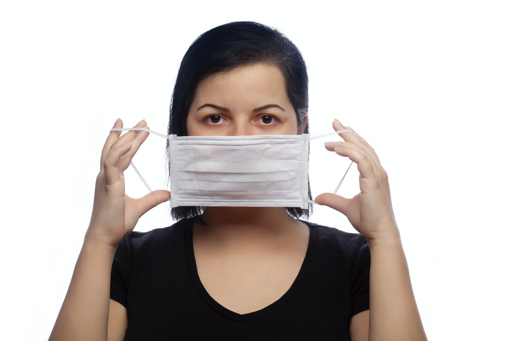
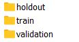

# Face Mask Detector

Ese Emuraye, Pragya Srivastava, Sheldon Sebastian

Photo by <a href="https://unsplash.com/@onderortel?utm_source=unsplash&utm_medium=referral&utm_content=creditCopyText">Önder Örtel</a> on <a href="https://unsplash.com/s/photos/face-mask?utm_source=unsplash&utm_medium=referral&utm_content=creditCopyText">Unsplash</a>

  

## Introduction

 

The goal of our project is to identify whether a person is <b>correctly</b> wearing a mask or not. A person
correctly wears a mask when the mask completely covers his mouth and nose.

 
COVID-19, as we know, is a pandemic that has claimed millions of lives in the year 2020. Wearing
a face mask has been identified as a successful method of preventing the spread of COVID
amongst people. It is strongly recommended to wear a mask in public places. Most people follow
the guidelines and wear masks. Some people do not wear it while others wear it incorrectly which
doesn’t cover their nose/mouth as it should.

 
Our project aims to train a model on images of people wearing masks and develop an interface to
identify faces of people wearing the mask correctly, wearing it incorrectly or not wearing a mask.

## Dataset

For our project we used the MaskedFace-Net dataset[1]. This dataset is a synthetic dataset created
using Generative Adversarial Network (GAN) on the Flickr-Faces-HQ Dataset[2]. The
MaskedFace-Net model created synthetic images of people wearing the mask correctly and
incorrectly. For our project we also wanted to identify whether the person was wearing a mask or
not. So we added the original Flickr-Faces-HQ dataset images of people not wearing a mask to
achieve this task.
 
The data was downloaded using CURL command and the python scripts are available in the Data
Download Scripts Folder of the Github repository. The final combined dataset contains 60,000
images and is 15 GB in size.
 
Of the 60,000 images 20,000 images were of incorrect worn masks, 20,000 images were of
correct worn masks and 20,000 images were of uncovered faces.
 
80% of the dataset was used for training and 20% was used as holdout or test set. The script to
split into train-validation and holdout is found in DataPreprocessing.py. The data was organized
such that it was accessible using the ImageFolder API of Pytorch.

## Appendix

1. Link to all code files:
 
 https://github.com/sheldonsebastian/face_mask_detector
 

